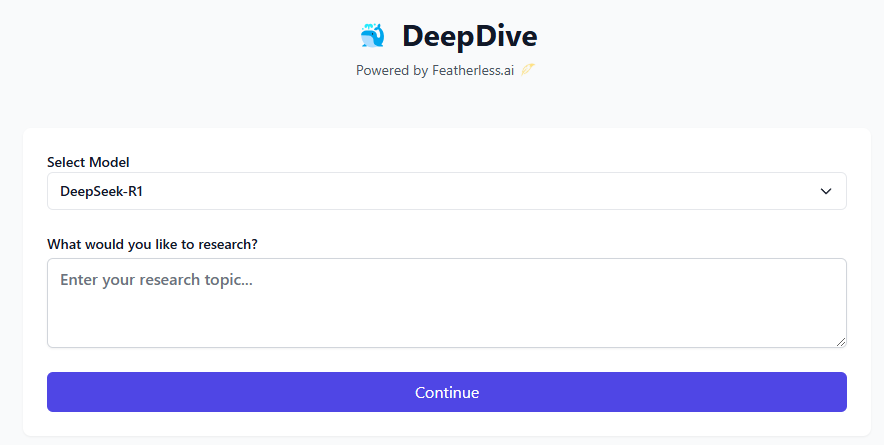

# DeepDive 🐋 


A web interface for [Open Deep Research](https://github.com/dzhng/deep-research), an AI-powered research assistant that performs iterative, deep research on any topic by combining search engines, web scraping, and large language models.

This project builds upon the original CLI tool by adding:
- A modern web interface with real-time research progress
- Support for multiple AI models (DeepSeek-R1, Qwen2.5, & others) powered by [Featherless.ai](https://featherless.ai/) 🪶
- Concurrent processing capabilities
- Downloadable markdown reports

### Research Flow
1. Enter research query
2. Select AI model
3. Configure research parameters
4. Answer follow-up questions
5. Watch real-time research progress
6. Get formatted markdown report

## Technical Implementation

The web interface is built with:
- React + TypeScript
- Tailwind CSS for styling
- Vite for development and building
- Express backend for API handling

## Detailed Installation Steps

1. **Clone the Repository**
   ```bash
   git clone <repository-url>
   cd featherless-deepdive
   ```

2. **Install Dependencies**
   ```bash
   npm install
   ```

3. **Set up Environment Variables**
   Create a `.env.local` file in the root directory:
   ```bash
   FIRECRAWL_KEY="your_firecrawl_key"
   FEATHERLESS_KEY="your_featherless_key"
   ```

4. **Verify Tailwind Configuration**
   The project uses Tailwind CSS with typography and forms plugins. The configuration files should be present:
   - tailwind.config.js
   - postcss.config.js
   - src/client/index.css

   If any are missing, create them with the following content:

   postcss.config.js:
   ```javascript
   module.exports = {
     plugins: {
       tailwindcss: {},
       autoprefixer: {},
     },
   }
   ```

   src/client/index.css:
   ```css
   @tailwind base;
   @tailwind components;
   @tailwind utilities;
   ```

5. **Start Development Server**
   ```bash
   # Start both frontend and backend
   npm run dev

   # Or start them separately:
   npm run frontend  # Starts Vite dev server
   npm run backend   # Starts Express server
   ```

6. **Access the Application**
   - Frontend: http://localhost:5173
   - Backend: http://localhost:3000

7. **Verify Installation**
   - Check if the dark/light theme toggle works
   - Verify model selection dropdown is populated
   - Test a simple research query

## Troubleshooting

- If you encounter missing TypeScript types, run:
  ```bash
  npm install @types/node @types/react @types/react-dom --save-dev
  ```

- If Tailwind styles are not working, verify that your `tailwind.config.js` includes the correct content paths:
  ```javascript
  module.exports = {
    content: [
      "./index.html",
      "./src/**/*.{js,ts,jsx,tsx}",
    ],
    // ...rest of config
  }
  ```

- For environment variable issues, make sure you're using the correct format in `.env.local` and that the file is in the root directory

## Usage

1. Open the web interface in your browser
2. Enter your research query
3. Select an AI model from the dropdown
4. Adjust research parameters:
   - Breadth (2-10): Controls number of parallel searches
   - Depth (1-5): Controls how many levels deep the research goes
   - Concurrency: Number of parallel processes (model-dependent)
5. Answer the follow-up questions to refine the research
6. Monitor real-time progress
7. Download or view the final report

## Notes

- Concurrent processing is automatically limited based on model capabilities
- Larger models (70B+) are limited to single concurrent operations
- Smaller models support up to 4 concurrent operations
- Dark/light theme preference is automatically saved


# Community & Support
Our growing community of developers, enthusiasts, and AI practitioners is here to help you get the most out of Featherless:
- Join our [Discord](https://discord.gg/7gybCMPjVA) community to connect with other users
- Share your experiences with us!
- Follow us on [X](https://x.com/FeatherlessAI) for the latest updates
- Try out [DeepSeek-R1](https://featherless.ai/blog/deepseek-r1-available-for-premium-users) with unlimited tokens on our premium plan!

# License
MIT License


